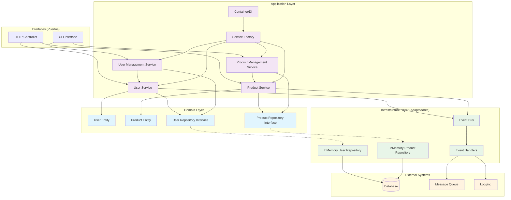
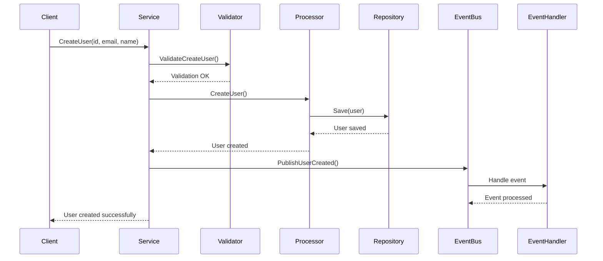

# Diagrama de Arquitectura Hexagonal

## Arquitectura del Sistema

## Flujo de Datos

## Patrones Implementados

### 1. Repository Pattern
- **Interfaz**: Define el contrato para acceso a datos
- **Implementación**: Encapsula la lógica de persistencia
- **Beneficio**: Desacopla el dominio de la infraestructura

### 2. Factory Pattern
- **Factory**: Crea servicios con dependencias inyectadas
- **Container**: Gestiona el ciclo de vida de las dependencias
- **Beneficio**: Centraliza la creación de objetos complejos

### 3. Service Layer Granular
- **Validator**: Validación de datos de entrada
- **Processor**: Lógica de negocio y persistencia
- **Publisher**: Publicación de eventos
- **Service**: Orquestación de los componentes

### 4. Dependency Injection
- **Container**: Contenedor de dependencias
- **Lazy Loading**: Servicios creados bajo demanda
- **Beneficio**: Inversión de control y testabilidad

## Principios SOLID Aplicados

- **S** - Single Responsibility: Cada clase tiene una responsabilidad
- **O** - Open/Closed: Abierto para extensión, cerrado para modificación
- **L** - Liskov Substitution: Las implementaciones son intercambiables
- **I** - Interface Segregation: Interfaces específicas y cohesivas
- **D** - Dependency Inversion: Dependencias hacia abstracciones